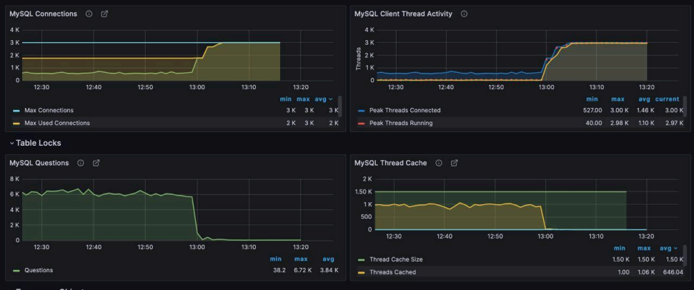

### 1. Для файла access.log вывести список с суммарным объемом данных, который передал сервер для каждого IP-адреса в формате:

1338 bytes for 1.2.3.4
100500 bytes for 123.23.1.2

В качестве ответа на вопрос напишите bash-однострочник.

### Ответ:
```bash
awk '$10 != "-" {bytes[$1] += $10} END {for (ip in bytes) printf "%d bytes for %s\n", bytes[ip], ip}' access.log
```

### 2. Используя lsof необходимо вывести список всех ESTABLISHED TCP соединений. В качестве ответа на вопрос напишите bash-однострочник.

### Ответ:
```bash
sudo lsof -nP -i tcp -s tcp:established
```
### 3. По скриншоту мониторинга определите причину недоступности сервиса. Определите время недоступности.



Ответ:
Согласно графику MySQL Connections, количество SQL запросов достигает пика приблизительно в 13:05 и доходит до максимального уровня. Также к этому времени увеличивается Threads на графике MySQL Client Thread Activity. 
В то же время, количество запросов и кэш падают. 
Все это указывает на то, что проблемой стал лимит SQL подключений, который необходимо увеличивать, либо искать участок, где приложение не может закрыть соединения.

### 4. Ниже представлен манифест Dockerfile, который содержит несколько недочетов.
### В качестве ответа укажите на текущие проблемы, оставив комментарий по каждой инструкции, и опишите, как их можно исправить, оптимизировав при этом использование слоев итогового образа.

```yml
FROM ubuntu:latest
MAINTAINER MyCompany
COPY . /var/www/html
RUN apt-get update -y
RUN apt-get install -y nginx
CMD ["nginx", "-g", "daemon off;"]
```

### Ответ:
```yml
FROM ubuntu:latest # я бы не стал использовать флаг "latest", т.к. вся система может быть настроена под определенную версию
                   # лучше указывать конкретную версию, т.к., если "latest" дистрибутив изменится, то сервер может лечь
MAINTAINER MyCompany # устаревший MAINTAINER, лучше использовать LABEL
COPY . /var/www/html # не нужно загружать файлы до update & install
RUN apt-get update -y # update & install лучше использовать совместно через &&, т.к. update проверяет пакеты на необходимость обновления и сохраняет этот список в кэш, который при отдельном использовании может неправильно сработать
RUN apt-get install -y nginx # смотри предыдущий пункт
CMD ["nginx", "-g", "daemon off;"]
```

Исправленный манифест:
```yml
FROM ubuntu:22.04

LABEL 

RUN apt-get update \
   && apt-get install -y nginx \
   && rm -rf /var/lib/apt/lists/* # удаление кэша индекса пакетов, чтобы не занимать места на диске

COPY . var/www/html

CMD ["nginx", "-g", "daemon off;"]
```

### 5. Вы отвечаете за доступность проекта. Внезапно на одном из узлов перестает отвечать веб-сервер Nginx. Пользователи сообщают о том, что не могут получить доступ к веб-сайту, обслуживаемому этим веб-сервером.
### В качестве ответа опишите действия, которые вы бы предприняли для диагностики и решения проблемы, чтобы минимизировать время простоя сервиса.

### Ответ:
1. Для начала необходимо понять, было ли недавно какое-либо обновление нашего веб-сервера Nginx. Если "да", то возможно сразу сделать rollback, чтобы откатиться и не терять пользователей. 
2. При возможности, временно вывести узел из балансировщика нагрузки.
3. Непосредственно для выяснения причин падения веб-сервера необходимо проверить доступность самого узла через ping и ssh. Если сервер недоступен, то возможно падение виртуальной машины. Возможно, необходимо перезапустить виртуальную машину.
4. На самом сервере проверить статус nginx через systemctl status nginx. Если сервер упал, то пробовать перезапустить через systemctl restart nginx.
5. Проверить, слушает ли Nginx порты: ss -tulpn | grep nginx. Если порт не слушается, то, возможно, неправильная конфигурация веб-сервера Nginx. Нужно исправить и перезапустить.
6. Проверить логи: tail -f /var/log/nginx/error.log. Возможно, удастся понять: неправильная конфигурация/нехватка памяти/слишком много соединений.
7. Проверить ресурсы сервера. Возможно, не хватает оперативной памяти, места на диске (inode) или мощностей процессора. Пробовать освободить ресурсы и очистить диск.
8. После восстановления провести анализ причины поломки и принять меры, чтобы проблема не повторилась.

### 6. Есть образ с сервисом, который запускается локально командой:
```yml
docker run -d -p 8080:80 --name my-app my-app-image
```
### Нужно развернуть его в Kubernetes, чтобы оно было доступно снаружи кластера, устойчиво к сбоям (например, перезапускалось при падении) и могло легко масштабироваться. Опишите шаги и манифесты для развертывания.

Пробую понять и сделать это задание в первый раз, т.к. самостоятельно с настройкой Kubernetes не сталкивался.
Как раз изучу какие-то моменты для себя.
Понятия:

Pod - минимальная единица запуска в Kubernetes. Pod содержит один или несколько контейнеров. Все контейнеры в Pod: делят один IP, могут использовать общие volumes. Pod временный: если умер, создается новый через контроллер.

Deployment - это контроллер pod. Он управляет количеством Pod, обновлением, перезапуском, масштабированием. Основной параметр replicas: 2 - сколько pod должно работать. Если pod упал, создается новый.

Service создает постоянную точку доступа. Service делает load balancing между pod. Типы Service: ClusterIP - доступ только внутри кластера, NodePort - открывает порт на ноде, LoadBalancer - внешний балансировщик, ExternalName - DNS alias.

Ingress используется для HTTP/HTTPS маршрутизации.

ConfigMap хранит конфигурацию приложения.

Secret хранит секретные данные.

### Ответ:
1. Для начала необходимо сделать docker-образ доуступным кластеру. Для этого его нужно загрузить в registry (Docker hub, GitHub Container Registry и т.п). Далее мы сможем использовать образ для загрузки. 

2. Создать манифест deployment.yaml:

```yaml
apiVersion: apps/v1 # Версия API Kubernetes для Deployment
kind: Deployment # Тип объекта, котоырй создаем. Объекты бывают: 
metadata:
    name: my-app # Имя Deployment в кластере
spec:
    replicas: 2 # Количество Pod, которые должны быть запущены. Если 1 pod упадет, будет создан новый
    selector: # Selector говорит Deployment, какими pod он управляет
        matchLabels:
            app: my-app 
    template: # Шаблон pod, которые будет создавать Deployment
        metadata: # Метки pod. Service и Deployment используют их для поиска pod
            labels:
                app: my-app 
        spec:
            containers: # Контейнеры, которые будут запущены внутри pod
                - name: my-app
                  image: myrepo/my-app:1.0 # Docker образ приложения. Он должен быть доступен из registry
                  ports:
                    - containerPort: 80 # Порт, который слушает контейнер
``` 
3. Создать манифест service.yaml:

```yaml
apiVersion: v1 # Версия API для Service
kind: Service # Тип объекта
metadata:
    name: my-app-svc # Имя сервиса
spec:
    type: NodePort # Тип сервиса. NodePort открывает порт на каждой ноде кластера
    selector:
        app: my-app # Selector определяет, к каким pod сервис будет направлять трафик
    ports: # Описание портов сервиса
        - port: 80 # порт сервиса внутри кластера
          targetport: 80 # порт контейнера
          nodePort: 30080 # внешний порт на ноде
```
4. Применение манифестов:

```bash
kubectl apply -f deployment.yaml
kubectl apply -f service.yaml
```
5. Проверка:

```bash
kubectl get pods
kubectl get svc
```

6. Масштабирование:

```bash
kubectl scale deployment my-app --replicas=5
```

### 7. Вы получаете сообщение от заказчика: «Проект опять не работает!». Что будете делать?

### Ответ:
1. Самое главное - не паниковать и спокойно задать заказчику уточняющие вопросы, чтобы понять предшествующие обстоятельства, детали и что именно не работает.
2. Проверить мониторинг и алерты.
3. Самостоятельно попробовать понять в чем смысл проблемы. То есть зайти в сервис как пользователь.
4. Проверить состояние инфраструктуры: доступность серверов, состояние сервисов, сетевых подключений.
5. Провести мероприятия по восстановлению сервиса (перезапуск, rollback, переключение на резервный узел).
6. Выяснение причин инцидента и его анализ для предотвращения падения сервиса в дальнейшем.
